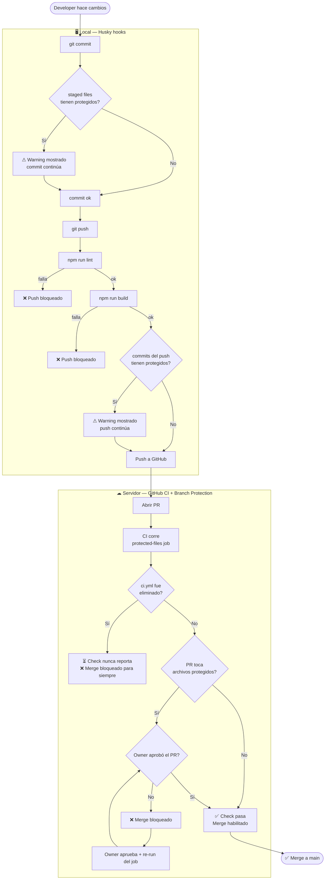

# boogiepop-platform-guards

Guards de CI centralizados para los seeds de la plataforma Boogiepop. La lógica vive acá — los proyectos solo importan el workflow.

## Estrategia de protección

Dos capas independientes. La primera da feedback rápido al developer; la segunda es el enforcement real que no se puede saltear.

| Capa | Mecanismo | Bypasseable | Propósito |
|------|-----------|-------------|-----------|
| Local | Husky hooks (`pre-commit` / `pre-push`) | Sí (`--no-verify`) | Advertir antes de commitear/pushear |
| Servidor | GitHub CI + branch protection | No (`enforce_admins: true`) | Bloquear el merge |

### Archivos protegidos

| Archivo / directorio | Por qué |
|----------------------|---------|
| `AGENTS.md` | Contrato de comportamiento del agente IA del seed |
| `.github/workflows/` | Pipeline de CI — incluye los guards |

---

## Diagrama de flujo



---

## GitHub — Setup por proyecto

### 1. Workflow CI del proyecto

Crear `.github/workflows/ci.yml`:

```yaml
name: CI

on:
  pull_request:

jobs:
  protected-files:
    uses: blanck1945/boogiepop-platform-guards/.github/workflows/protected-files.yml@main
    with:
      owner_username: blanck1945
```

### 2. Branch protection en `main`

Vía API o Settings → Branches → Edit `main`:

- **Require status checks to pass** → agregar `protected-files / check-protected-files`
- **Require branches to be up to date** → activado
- **Do not allow bypassing the above settings** → activado (`enforce_admins: true`)

> El nombre exacto del check se puede verificar con:
> `GET /repos/{owner}/{repo}/commits/{sha}/check-runs`

### 3. Husky hooks (pre-commit y pre-push)

Instalar Husky en el proyecto:

```bash
npm install --save-dev husky
```

Agregar a `package.json`:

```json
"scripts": {
  "prepare": "husky"
}
```

Crear `.husky/pre-commit` — advierte si se commitean archivos protegidos:

```sh
#!/bin/sh
STAGED=$(git diff --cached --name-only)
FOUND=""

for f in AGENTS.md; do
  echo "$STAGED" | grep -qx "$f" && FOUND="$FOUND $f"
done
for d in .github/workflows; do
  echo "$STAGED" | grep -q "^$d/" && FOUND="$FOUND $d/"
done

if [ -n "$FOUND" ]; then
  echo ""
  echo "WARNING: archivos protegidos en este commit:"
  for f in $FOUND; do echo "  - $f"; done
  echo "  El PR va a requerir aprobacion del Owner para mergear."
  echo ""
fi
```

Crear `.husky/pre-push` — corre lint + build y advierte si el push toca archivos protegidos:

```sh
#!/bin/sh
echo "lint..."
npm run lint || exit 1
echo "build..."
npm run build || exit 1

FOUND=""
while read local_ref local_sha remote_ref remote_sha; do
  if [ "$remote_sha" = "0000000000000000000000000000000000000000" ]; then
    BASE=$(git merge-base "$local_sha" github/main 2>/dev/null || git merge-base "$local_sha" origin/main 2>/dev/null || echo "")
    RANGE="${BASE:+$BASE..}$local_sha"
  else
    RANGE="$remote_sha..$local_sha"
  fi

  CHANGED=$(git diff --name-only $RANGE 2>/dev/null)

  for f in AGENTS.md; do
    echo "$CHANGED" | grep -qx "$f" && FOUND="$FOUND $f"
  done
  for d in .github/workflows; do
    echo "$CHANGED" | grep -q "^$d/" && FOUND="$FOUND $d/"
  done
done

if [ -n "$FOUND" ]; then
  echo ""
  echo "WARNING: archivos protegidos en este push:"
  for f in $FOUND; do echo "  - $f"; done
  echo "  El PR va a requerir aprobacion del Owner para mergear."
  echo ""
fi
```

---

## GitLab — Setup por proyecto

### 1. Incluir el guard en el pipeline

En `.gitlab-ci.yml` del seed:

```yaml
include:
  - project: 'boogiepop-phatom/boogiepop-platform-guards'
    file: '/guards/protected-files.yml'
    ref: main

stages:
  - verify
  - build
  - deploy
```

### 2. Variables CI/CD a nivel grupo (una sola vez)

En **GitLab → grupo `boogiepop-phatom` → Settings → CI/CD → Variables**:

| Variable | Valor | Flags |
|----------|-------|-------|
| `PLATFORM_API_TOKEN` | Group Access Token con scope `read_api` | Masked, Protected |
| `PLATFORM_OWNER_USERNAME` | Username GitLab del Owner | — |

### 3. Branch protection en `main` (por seed)

En **Settings → Repository → Protected Branches → `main`**:

| Campo | Valor |
|-------|-------|
| Allowed to push | No one |
| Require a successful pipeline | ✅ activado |

### Límite conocido (GitLab Free)

Sin Push Rules (Premium), si alguien elimina el `include:` y el job local `check-ci-integrity` al mismo tiempo, los guards no corren. Mitigación: dual guard — ambos tienen que eliminarse a la vez, lo que es visible en el diff del MR.

---

## Agregar archivos protegidos

Editar la lista `PROTECTED_FILES` / `PROTECTED_DIRS` en:
- GitHub: `.github/workflows/protected-files.yml`
- GitLab: `guards/protected-files.yml`

Solo mantenedores de plataforma tienen acceso de escritura a este repo.
