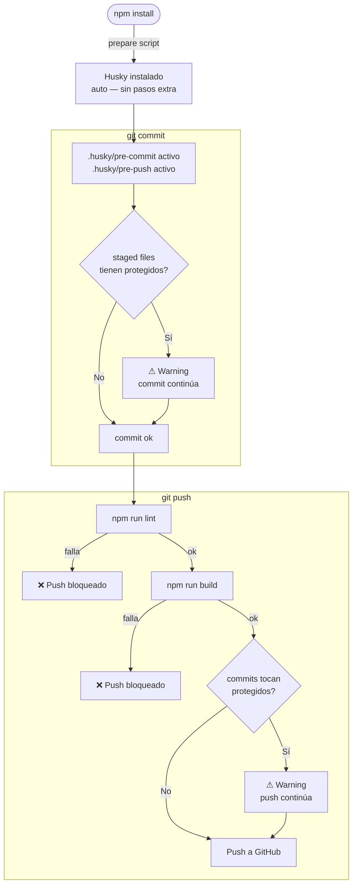
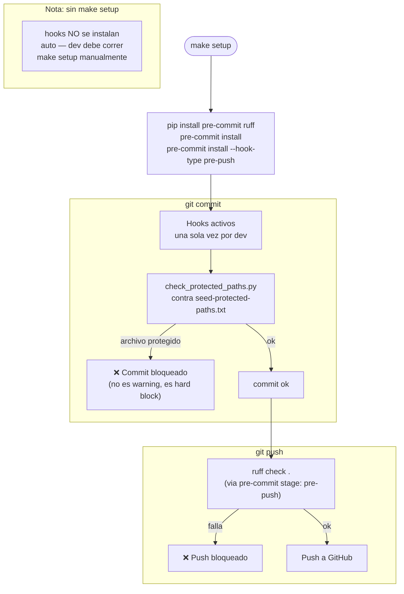

# Aplicar guards a un nuevo seed

Pasos para replicar la protección completa en cualquier seed nuevo.

---

## Comparación por stack

| | Node.js (React / Next) | Python (Streamlit) |
|---|---|---|
| Hook manager | **Husky** | **pre-commit** |
| Auto-install hooks | `npm install` → `prepare` script | `make setup` |
| Lint pre-push | `npm run lint` + `npm run build` | `ruff check .` |
| Guard pre-commit | Warn-only (shell) | Bloquea (Python `check_protected_paths.py`) |
| CI guard | Idéntico | Idéntico |
| Branch protection | Idéntico | Idéntico |

---

## Diagrama — Node.js (Husky)



---

## Diagrama — Python (pre-commit + Makefile)



---

## Seeds Node.js — Setup completo

### 1. CI workflow

Crear `.github/workflows/ci.yml`:

```yaml
name: CI

on:
  push:
    branches: [main, develop]
  pull_request:

jobs:
  protected-files:
    uses: blanck1945/boogiepop-platform-guards/.github/workflows/protected-files.yml@main
    with:
      owner_username: blanck1945

  ci:
    runs-on: ubuntu-latest
    steps:
      - uses: actions/checkout@v4
      - uses: actions/setup-node@v4
        with:
          node-version: 22
          cache: npm
      - run: npm ci
      - run: npm run lint
      - run: npm run build
```

### 2. Husky

```bash
npm install --save-dev husky
npx husky
```

Agregar a `package.json`:

```json
"scripts": {
  "prepare": "husky"
}
```

Crear `.husky/pre-commit`:

```sh
#!/bin/sh
STAGED=$(git diff --cached --name-only)
FOUND=""

for f in AGENTS.md; do
  echo "$STAGED" | grep -qx "$f" && FOUND="$FOUND $f"
done
for d in .github/workflows; do
  echo "$STAGED" | grep -q "^$d/" && FOUND="$FOUND $d/"
done

if [ -n "$FOUND" ]; then
  echo ""
  echo "WARNING: archivos protegidos en este commit:"
  for f in $FOUND; do echo "  - $f"; done
  echo "  El PR va a requerir aprobacion del Owner para mergear."
  echo ""
fi
```

Crear `.husky/pre-push`:

```sh
#!/bin/sh
echo "lint..."
npm run lint || exit 1
echo "build..."
npm run build || exit 1

FOUND=""
while read local_ref local_sha remote_ref remote_sha; do
  if [ "$remote_sha" = "0000000000000000000000000000000000000000" ]; then
    BASE=$(git merge-base "$local_sha" github/main 2>/dev/null || git merge-base "$local_sha" origin/main 2>/dev/null || echo "")
    RANGE="${BASE:+$BASE..}$local_sha"
  else
    RANGE="$remote_sha..$local_sha"
  fi

  CHANGED=$(git diff --name-only $RANGE 2>/dev/null)

  for f in AGENTS.md; do
    echo "$CHANGED" | grep -qx "$f" && FOUND="$FOUND $f"
  done
  for d in .github/workflows; do
    echo "$CHANGED" | grep -q "^$d/" && FOUND="$FOUND $d/"
  done
done

if [ -n "$FOUND" ]; then
  echo ""
  echo "WARNING: archivos protegidos en este push:"
  for f in $FOUND; do echo "  - $f"; done
  echo "  El PR va a requerir aprobacion del Owner para mergear."
  echo ""
fi
```

### 3. Branch protection (vía API)

```powershell
$token = "<GITHUB_TOKEN>"
$repo  = "<repo-name>"
$headers = @{ Authorization = "Bearer $token"; Accept = "application/vnd.github+json"; "Content-Type" = "application/json" }
$body = @{
  required_status_checks = @{
    strict   = $true
    contexts = @("protected-files / check-protected-files")
  }
  enforce_admins = $true
  required_pull_request_reviews = @{
    dismiss_stale_reviews           = $true
    require_last_push_approval      = $false
    required_approving_review_count = 0
  }
  restrictions = $null
} | ConvertTo-Json -Depth 5
Invoke-RestMethod -Method PUT -Uri "https://api.github.com/repos/blanck1945/$repo/branches/main/protection" -Headers $headers -Body $body
```

---

## Seeds Python — Setup completo

### 1. CI workflow

El job `protected-files` es idéntico. Solo cambia el job `ci`:

```yaml
name: CI

on:
  push:
    branches: [main, develop]
  pull_request:

jobs:
  protected-files:
    uses: blanck1945/boogiepop-platform-guards/.github/workflows/protected-files.yml@main
    with:
      owner_username: blanck1945

  ci:
    runs-on: ubuntu-latest
    steps:
      - uses: actions/checkout@v4
      - uses: actions/setup-python@v5
        with:
          python-version: "3.12"
      - run: pip install ruff
      - run: ruff check .
```

### 2. pre-commit + Makefile

Agregar a `.pre-commit-config.yaml`:

```yaml
repos:
  - repo: local
    hooks:
      - id: protect-seed-paths-local
        name: Validar infra seed (lista maintainers/)
        language: python
        entry: python scripts/pre_commit_seed_guard_wrapper.py
        pass_filenames: false
        always_run: true

  - repo: https://github.com/astral-sh/ruff-pre-commit
    rev: v0.11.13
    hooks:
      - id: ruff
        name: lint (ruff) — pre-push
        args: [--fix]
        stages: [pre-push]
```

Agregar `AGENTS.md` a `maintainers/seed-protected-paths.txt`.

Crear `Makefile`:

```makefile
.PHONY: setup lint

setup:
	pip install pre-commit ruff
	pre-commit install
	pre-commit install --hook-type pre-push

lint:
	ruff check .
```

> El dev corre `make setup` una sola vez al clonar el repo. Sin esto, los hooks no se activan (no hay equivalente al `prepare` de npm).

### 3. Branch protection

Idéntico al de Node.js — mismo script PowerShell.

---

## Checklist por seed

- [ ] `.github/workflows/ci.yml` con job `protected-files`
- [ ] Hook manager configurado: Husky (`prepare` en package.json) o pre-commit (`Makefile`)
- [ ] `AGENTS.md` en la lista de archivos protegidos
- [ ] Branch protection: required check + `enforce_admins` + `dismiss_stale_reviews`
- [ ] Verificar nombre exacto del check: `GET /repos/{owner}/{repo}/commits/{sha}/check-runs`
